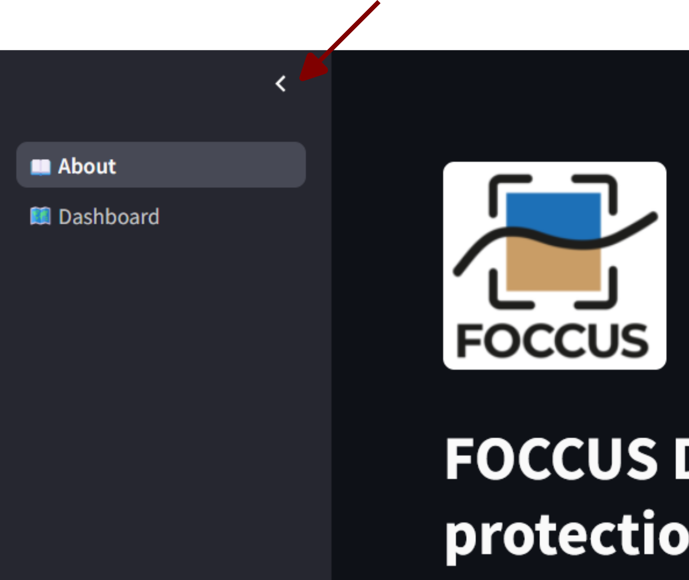
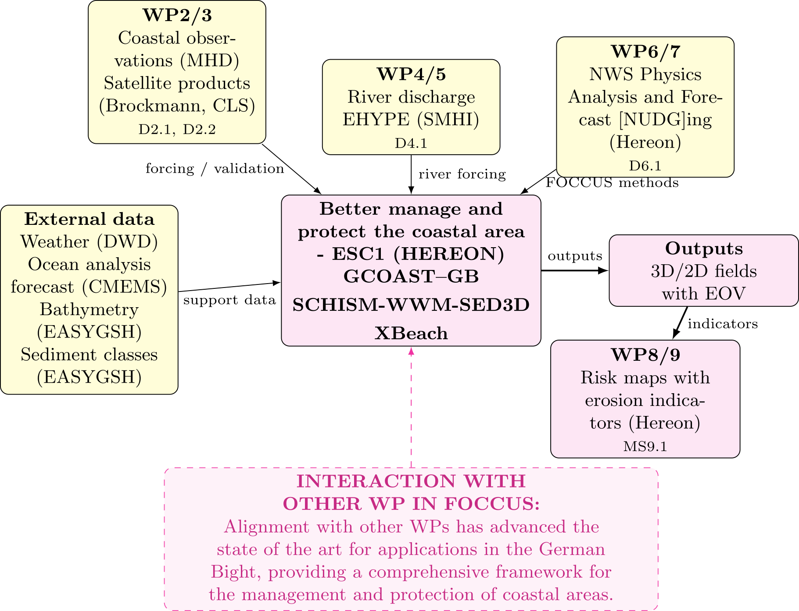

  
  

# FOCCUS Demonstrator: Management and protection of the coastal area - German Bight  

## Why - Objective and Background ?

The objective of this demonstrator is to showcase the results of Application 2.1.2.2 ([D8.1](https://docs.google.com/document/d/1AXOMLxra9OLt3CGxj5IWgSxqhNLrOAe-/edit)), which addresses the Environmental and Societal Challenge (ESC) from Topic Group 1: **Coastal Erosion Dynamics** for the German Bight pilot area.

Coastal flooding and erosion are becoming increasingly severe due to extreme storms and rising sea levels. Addressing these challenges requires reliable forecasting tools that accurately represent the hydrodynamic, wave, and sediment-morphodynamic processes driving coastal change. Within ESC1, the [GCOAST-GB](https://www.hereon.de/institutes/coastal_systems_analysis_modeling/research/gcoast/applications/index.php.en) forecasting system has been enhanced and extended across the land–ocean continuum. In addition, this downstream  application (select the dashboard from the sidebar to start the application):

has been developed to support coastal risk assessment and adaptation planning.

The application aims to:

- assess coastal erosion and hazard risks using dedicated indicators;
- provide actionable metrics to support risk assessment, early warning, and decision-making;
- demonstrate scenario-based *what-if* analyses of Nature-based Solutions (NbS), represented by coastal vegetation buffers, to evaluate their potential to increase coastal resilience by comparing forecasts with observed vegetation against a vegetation-free reference scenario.

## Target Audience

This application is aimed at MSCS operators, coastal managers, and stakeholders for early warning and decision-making in the planning of nature-based coastal protection.

# WHAT - What is assessed ?

The application evaluates erosion risk based on forecast simulations and allows to quantify the effectiveness of Nature-based Solutions in terms of indicator metrics through  their comparisons between forecast simulations with and without seagrass vegetation.

## Assessments and Metrics and Indicators

The following indicators metrics summarise extreme and erosion-relevant conditions over the forecast period. They are derived from SCHISM/GCOAST-GB simulations on the native unstructured mesh and exported for interactive viewing and polygon-based area assessment.

| Indicator | Symbol / variable | Description | Unit |
|-----------|-------------------|-------------|------|
| Sea-surface height q95 | SSH q95 | 95th percentile of sea-surface height | m |
| Significant wave height q95 | Hs q95 | 95th percentile of significant wave height | m |
| Bottom stress q95 | τ q95 | 95th percentile of bed shear stress | Pa |
| Near-bottom suspended sediment concentration q95 | SSC q95 | 95th percentile of near-bottom suspended sediment concentration | — |
| Erosion risk ratio | R1 (ERI) | Relative duration of critical shear-stress exceedance (wet timesteps only) | — |
| Vegetation cover | nveg | Model seagrass / vegetation cover fraction | — |

### Erosion Risk Index (ERI)

The erosion risk index (R1) expresses the temporal fraction (of non dry) timesteps during which critical bed shear stress is exceeded, relative to a grain-size-distribution-dependent threshold. Values below 0.25 are masked (no risk). The categorical riskbins are:

| ERI class | Risk level | Critical shear-stress exceedance duration |
|---------|------------|-------------------------------------------|
| — | No risk | &lt; 25% |
| 0.25 – 0.50 | Low | 25 – 50% |
| 0.50 – 0.75 | Increased | 50 – 75% |
| ≥ 0.75 | High | ≥ 75% |

In the web application, R1 is shown with a stepped colour scale (yellow / orange / red) and can be assessed against selectable critical levels of **Low**, **Increased**, or **High** (No color denots no risk or outside of the domain).

### Interactive display and area assessment

The application allows users to **explore coastal hazard indicators** across the German Bight and perform **area-based assessments** for locations of interest.

Users can:

1. **Select a forecast and indicator** – Choose a simulation date and the indicator to explore (e.g. wave height, bed stress, erosion risk, or vegetation cover).
2. **Explore the map** – View the selected indicator on an interactive map. The colour scale, opacity, and basemap can be adjusted to improve visualization.
3. **Define an area of interest** – Draw a polygon around any coastal zone, such as a beach, harbour approach, or Nature-based Solution (NbS) site.
4. **Analyse the selected area** – The application provides:
   - summary statistics (mean, minimum, maximum, and total area);
   - the proportion of the area above or below a selected threshold;
   - the distribution of indicator values within the selected area;
   - a map highlighting where the threshold is exceeded.
5. **Compare scenarios** – Switch between different forecast runs or scenarios (e.g. with and without coastal vegetation) to evaluate changes in hazard indicators and assess the potential benefits of Nature-based Solutions.

###  

## HOW - How was this application made and improved within FOCCUS

Simulations are performed on an unstructured grid with coastward-increasing resolution (1.5 km to 100 m), enabling the representation of large-scale coastal processes while resolving nearshore dynamics. To assess beach-scale erosion and morphodynamic response, a high-resolution XBeach sub-nest (10 m × 10 m) is implemented. Vegetation effects are explicitly represented in both models, allowing the evaluation of different NbS configurations and their influence on hydrodynamics, wave attenuation, sediment transport, and coastal erosion.

The application workflow´s Modelling System integration within (among other inputs and developments) Copernicus Marine Services,
anf FOCCUS developments with links to the respecitve deliverables and milestones are given in the PDF embeded below.

streamlit_insert_pdf="DF122.pdf"

Further, the  GCOAST-GB system has undergone FOCCUS specific improvments related to different WP acitvities, such as:

- Upgrading river forcing from climatological to E-HYPE, enabling the representation of tributary inflows and improving simulated coastal salinities.
- Implementing temperature and salinity nudging within a boundary layer, to improve temperature and salinity simulation and prevent model drifts.
- Model seagrass distribution is parameterized using satellite-derived vegetation cover maps provided by Brockmann Consult based on Sentinel-2 observations and the Normalized Difference Vegetation Index (NDVI), upgrading the forecasts from a static to a dynamic seagrass representation.

The assesment methodology in the NbS-Postprocessing further builds on approaches developed for the German Bight [(Jacob et al. 2023)](https://link.springer.com/article/10.1007/s10236-023-01577-5) and detailed beach-scale erosion studies at Norderney [(Chen et al. 2024)](https://www.sciencedirect.com/science/article/pii/S0048969724023908):

